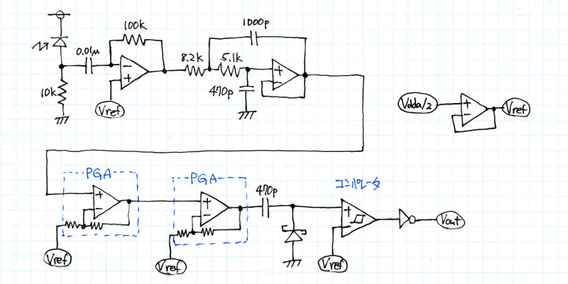

# VLCom (可視光通信ユニット)
PSoC 5LP Prototyping Kitを使用した可視光通信ユニット

## 送信器
Tx端子のパルス出力でLEDを駆動する。じゅうぶんな電流を駆動できるようにダーリントントランジスタやFET等で駆動する。

LEDは下記のもので実験した。
* [超高輝度5mm青色LED OSB56A5111A](http://akizukidenshi.com/catalog/g/gI-06403/)

## 受信器
下図のような回路になるように抵抗、コンデンサ、ダイオードを外付けする。

フォトダイオードは下記のもので実験した。
* [大面積Si PINフォトダイオード 960nm S6775](http://akizukidenshi.com/catalog/g/gI-04806/)
